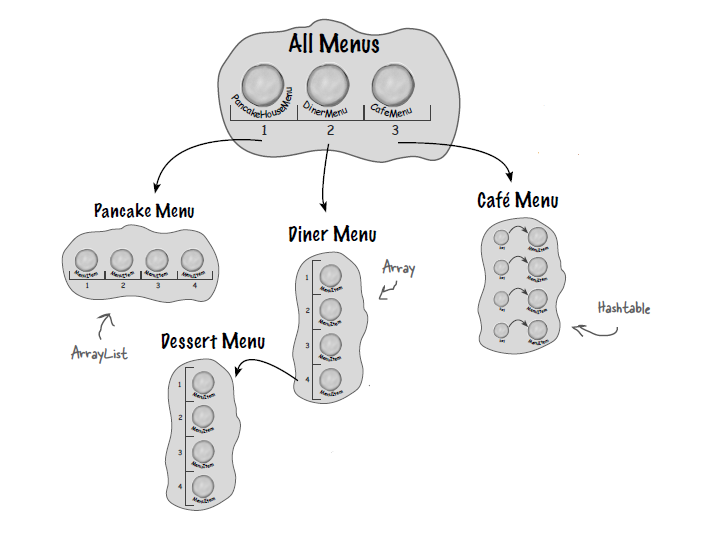
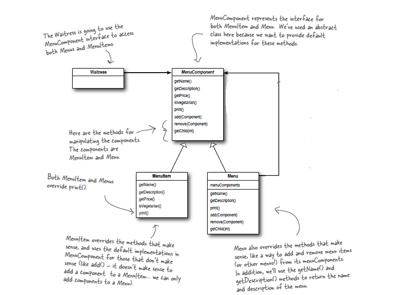

# CompositePattern
Demo Restaurant Project Designed with Composite Pattern
This project is developed as a part of "Head First Design Patterns, Book by Elisabeth Freeman and Kathy Sierra".
Aiming to show the implementation of "Composite Pattern".

The Composite Pattern allows you to compose objects into tree structures to represent part-whole hierarchies. Composite lets clients treat
individual objects and compositions of objects uniformly.

 
 
Using a composite structure, we can apply the same operations over both composites (Menu Class) and individual (MenuItem Class)
objects. In other words, in most cases we can ignore the differences between compositions of objects and individual objects. 
This means our Waitress Class (as Client) can iterate over the menus and menu items without knowing how they store their components.

